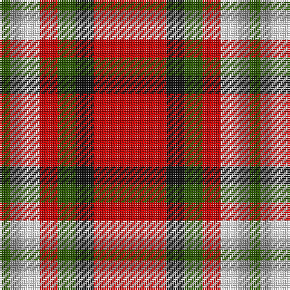

The parent of this is [Mangles, Peter and Annette (Personal](/tartans/g/6/n6/w10/r10/g10/k10/r/40/)

This was sourced from tartans-authority.  It is a [7 stripes tartan](/stripes/stripes7/).

Original link http://www.tartansauthority.com/tartan-ferret/display/10844/

## Thread count
G/6 N6 W10 R10 G10 K10 R/40

## Palette
Each colour and its ΔE from the base-6 reference it is a variant of.

| Colour | Shade | Base | ΔE (OKLab) |
|---|---|---|---|
| G |  `#285800` | G  | 0.04 |
| K |  `#101010` | K  | 0.17 |
| N |  `#888888` | R  | 0.24 |
| R |  `#C80000` | R  | 0.00 |
| W |  `#FCFCFC` | W  | 0.03 |

# Sample pattern

ID: /variants/g/6/n6/w10/r10/g10/k10/r/40-g285800-k101010-n888888-rc80000-wfcfcfc/
