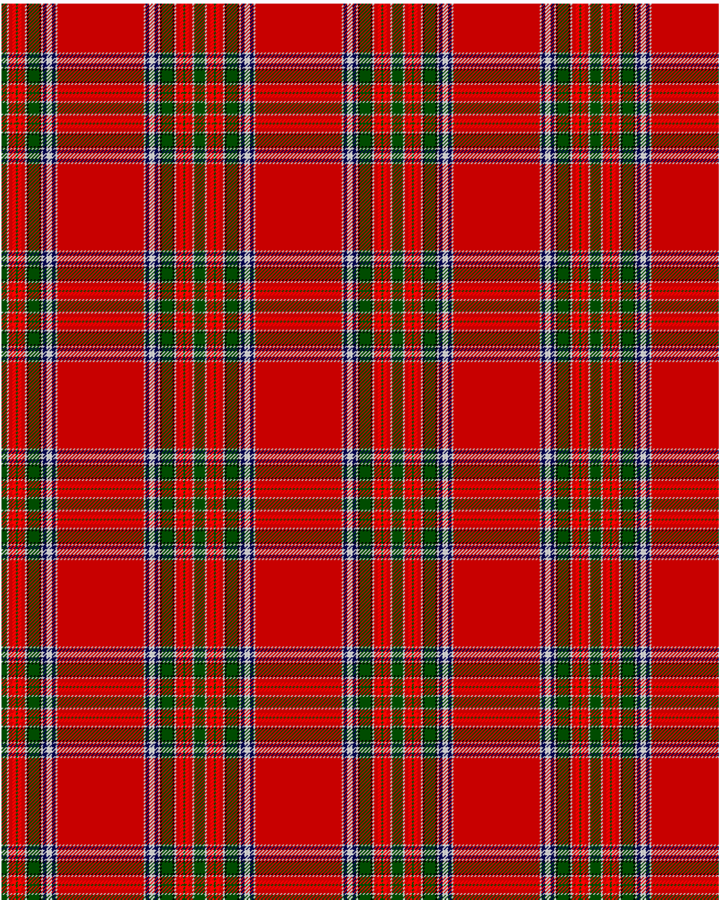

MacBean

This was sourced from <no value>.  It is a 19 stripes tartan.

Original link http://www.weddslist.com/cgi-bin/tartans/pg.pl?source=rb

## Thread count
G/6 NA2 R4 RA4 G2 RA4 R4 NA2 K2 G12 K2 NA2 DB4 N2 NA2 N2 DB4 NA2 R/48

## Palette
DB#00004C G#004C00 K#000000 N#D0D0D0 NA#C0C0C0 R#C80000 RA#FF0000

# Sample pattern

ID: /variants/g/6/na2/r4/ra4/g2/ra4/r4/na2/k2/g12/k2/na2/db4/n2/na2/n2/db4/na2/r/48-db00004c-g004c00-k000000-nd0d0d0-nac0c0c0-rc80000-raff0000