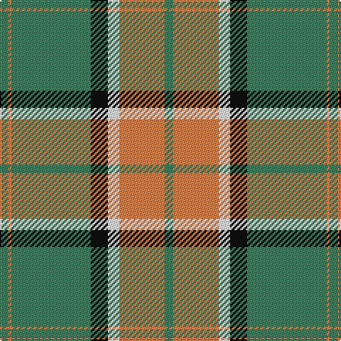

The parent of this is [Pollock](/tartans/g/6/o2/g56/k12/w8/o32/g/6/)

This was sourced from register-of-tartans.  It is a [7 stripes tartan](/stripes/stripes7/).

Original link https://www.tartanregister.gov.uk/tartanDetails.aspx?ref=3352

## Thread count
G/6 O2 G56 K12 W8 O32 G/6

## Palette
Each colour and its ΔE from the base-6 reference it is a variant of.

| Colour | Shade | Base | ΔE (OKLab) |
|---|---|---|---|
| G |  `#408060` | G  | 0.13 |
| K |  `#101010` | K  | 0.17 |
| O |  `#EC8048` | Y  | 0.17 |
| W |  `#F8F8F8` | W  | 0.01 |

# Sample pattern

ID: /variants/g/6/o2/g56/k12/w8/o32/g/6-g408060-k101010-oec8048-wf8f8f8/
