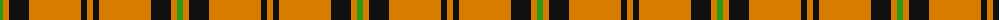

The parent of this is [Volkswagen Orange Trim](/tartans/g/6/o6/k20/o52/k6/o/6/)

This was sourced from register-of-tartans.  It is a [6 stripes tartan](/stripes/stripes6/).

Original link https://www.tartanregister.gov.uk/tartanDetails.aspx?ref=5544

## Thread count
G/6 O6 K20 O52 K6 O/6

## Palette
Each colour and its ΔE from the base-6 reference it is a variant of.

| Colour | Shade | Base | ΔE (OKLab) |
|---|---|---|---|
| G |  `#289C18` | G  | 0.18 |
| K |  `#101010` | K  | 0.17 |
| O |  `#D87C00` | Y  | 0.17 |

# Sample pattern

ID: /variants/g/6/o6/k20/o52/k6/o/6-g289c18-k101010-od87c00/
