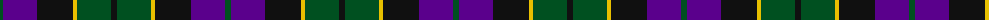

The parent of this is [Wilson's No.100](/tartans/g/6/p34/k36/y4/g34/k/6/)

This was sourced from register-of-tartans.  It is a [6 stripes tartan](/stripes/stripes6/).

Original link https://www.tartanregister.gov.uk/tartanDetails.aspx?ref=4674

## Thread count
G/6 P34 K36 Y4 G34 K/6

## Palette
Each colour and its ΔE from the base-6 reference it is a variant of.

| Colour | Shade | Base | ΔE (OKLab) |
|---|---|---|---|
| G |  `#005020` | G  | 0.08 |
| K |  `#101010` | K  | 0.17 |
| P |  `#5A008C` | B  | 0.12 |
| Y |  `#E8C000` | Y  | 0.00 |

# Sample pattern

ID: /variants/g/6/p34/k36/y4/g34/k/6-g005020-k101010-p5a008c-ye8c000/
