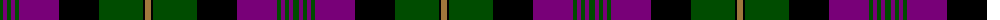

The parent of this is [Urbino (Fashion)](/tartans/g/6/p4/g4/p4/g4/p40/k40/g44/k2/lt/6/)

This was sourced from tartans-authority.  It is a [10 stripes tartan](/stripes/stripes10/).

Original link http://www.tartansauthority.com/tartan-ferret/display/4362/

## Thread count
G/6 P4 G4 P4 G4 P40 K40 G44 K2 LT/6

## Palette
Each colour and its ΔE from the base-6 reference it is a variant of.

| Colour | Shade | Base | ΔE (OKLab) |
|---|---|---|---|
| G |  `#004C00` | G  | 0.08 |
| K |  `#000000` | K  | 0.00 |
| LT |  `#A0783C` | R  | 0.18 |
| P |  `#780078` | B  | 0.16 |

ID: /variants/g/6/p4/g4/p4/g4/p40/k40/g44/k2/lt/6-g004c00-k000000-lta0783c-p780078/
