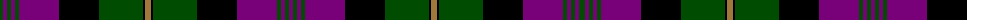

The parent of this is [Urbino](/tartans/g/6/p4/g4/p4/g4/p40/k40/g44/k2/lt6/k2/g44/k40/p40/g4/p4/g4/p/4/)

This was sourced from register-of-tartans.  It is a [18 stripes tartan](/stripes/stripes18/).

Original link https://www.tartanregister.gov.uk/tartanDetails.aspx?ref=4428

## Thread count
G/6 P4 G4 P4 G4 P40 K40 G44 K2 LT6 K2 G44 K40 P40 G4 P4 G4 P/4

## Palette
Each colour and its ΔE from the base-6 reference it is a variant of.

| Colour | Shade | Base | ΔE (OKLab) |
|---|---|---|---|
| DP |  `#4C1864` | B  | 0.11 |
| G |  `#004C00` | G  | 0.08 |
| K |  `#000000` | K  | 0.00 |
| LT |  `#A0783C` | R  | 0.18 |
| P |  `#780078` | B  | 0.16 |

ID: /variants/g/6/p4/g4/p4/g4/p40/k40/g44/k2/lt6/k2/g44/k40/p40/g4/p4/g4/p/4-dp4c1864-g004c00-k000000-lta0783c-p780078/
