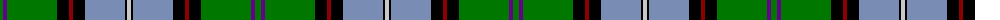

The parent of this is [Birch (Name)](/tartans/g/6/p4/g50/k12/dr4/k12/b40/k2/n/4/)

This was sourced from tartans-authority.  It is a [9 stripes tartan](/stripes/stripes9/).

Original link http://www.tartansauthority.com/tartan-ferret/display/2157/

## Thread count
G/6 P4 G50 K12 DR4 K12 B40 K2 N/4

## Palette
Each colour and its ΔE from the base-6 reference it is a variant of.

| Colour | Shade | Base | ΔE (OKLab) |
|---|---|---|---|
| B |  `#788CB4` | B  | 0.25 |
| DR |  `#8C0000` | R  | 0.13 |
| G |  `#007800` | G  | 0.06 |
| K |  `#000000` | K  | 0.00 |
| N |  `#C8C8C8` | W  | 0.13 |
| P |  `#64008C` | B  | 0.13 |

ID: /variants/g/6/p4/g50/k12/dr4/k12/b40/k2/n/4-b788cb4-dr8c0000-g007800-k000000-nc8c8c8-p64008c/
