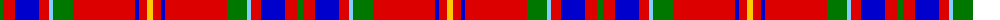

The parent of this is [Loch Linnhe](/tartans/g/6/r12/b24/r10/lb4/g20/r62/b4/r8/y/6/)

This was sourced from register-of-tartans.  It is a [10 stripes tartan](/stripes/stripes10/).

Original link https://www.tartanregister.gov.uk/tartanDetails.aspx?ref=11611

## Thread count
G/6 R12 B24 R10 LB4 G20 R62 B4 R8 Y/6

## Palette
Each colour and its ΔE from the base-6 reference it is a variant of.

| Colour | Shade | Base | ΔE (OKLab) |
|---|---|---|---|
| B |  `#0000CD` | B  | 0.15 |
| G |  `#007800` | G  | 0.06 |
| LB |  `#82CFFD` | W  | 0.18 |
| R |  `#DC0000` | R  | 0.04 |
| Y |  `#FCCC00` | Y  | 0.04 |

ID: /variants/g/6/r12/b24/r10/lb4/g20/r62/b4/r8/y/6-b0000cd-g007800-lb82cffd-rdc0000-yfccc00/
