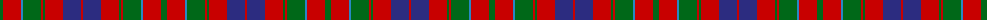

The parent of this is [Convention of the Baronage (Corp)](/tartans/g/6/r18/b2/g18/r2/g2/r18/db18/r/2/)

This was sourced from tartans-authority.  It is a [9 stripes tartan](/stripes/stripes9/).

Original link http://www.tartansauthority.com/tartan-ferret/display/2348/

## Thread count
G/6 R18 B2 G18 R2 G2 R18 DB18 R/2

## Palette
Each colour and its ΔE from the base-6 reference it is a variant of.

| Colour | Shade | Base | ΔE (OKLab) |
|---|---|---|---|
| B |  `#2888C4` | B  | 0.21 |
| DB |  `#2C2C80` | B  | 0.05 |
| G |  `#006818` | G  | 0.02 |
| R |  `#C80000` | R  | 0.00 |

ID: /variants/g/6/r18/b2/g18/r2/g2/r18/db18/r/2-b2888c4-db2c2c80-g006818-rc80000/
