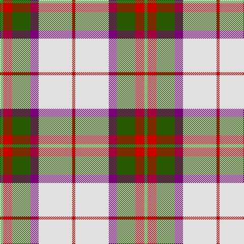

The parent of this is [MacKintosh Dress (Dance)](/tartans/g/6/r18/ga36/p16/ln66/r/6/)

This was sourced from register-of-tartans.  It is a [6 stripes tartan](/stripes/stripes6/).

Original link https://www.tartanregister.gov.uk/tartanDetails.aspx?ref=2570

## Thread count
G/6 R18 Ga36 P16 LN66 R/6

## Palette
Each colour and its ΔE from the base-6 reference it is a variant of.

| Colour | Shade | Base | ΔE (OKLab) |
|---|---|---|---|
| G |  `#289C18` | G  | 0.18 |
| Ga |  `#285800` | G  | 0.04 |
| LN |  `#E0E0E0` | W  | 0.06 |
| P |  `#780078` | B  | 0.16 |
| R |  `#C80000` | R  | 0.00 |

# Sample pattern

ID: /variants/g/6/r18/ga36/p16/ln66/r/6-g289c18-ga285800-lne0e0e0-p780078-rc80000/
