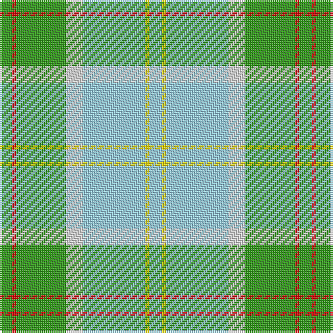

The parent of this is [Postcode Lottery](/tartans/g/6/r2/g24/ln8/lb30/y2/lb/6/)

This was sourced from register-of-tartans.  It is a [7 stripes tartan](/stripes/stripes7/).

Original link https://www.tartanregister.gov.uk/tartanDetails.aspx?ref=5988

## Thread count
G/6 R2 G24 LN8 LB30 Y2 LB/6

## Palette
Each colour and its ΔE from the base-6 reference it is a variant of.

| Colour | Shade | Base | ΔE (OKLab) |
|---|---|---|---|
| G |  `#309C18` | G  | 0.18 |
| LB |  `#98D0F0` | W  | 0.16 |
| LN |  `#E0E0E0` | W  | 0.06 |
| R |  `#DC0000` | R  | 0.04 |
| Y |  `#FADC00` | Y  | 0.08 |

# Sample pattern

ID: /variants/g/6/r2/g24/ln8/lb30/y2/lb/6-g309c18-lb98d0f0-lne0e0e0-rdc0000-yfadc00/
