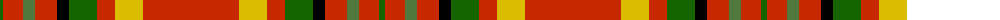

The parent of this is [Justerini & Brooks](/tartans/g/6/r20/ga12/r22/k12/g28/r18/y28/r/96/)

This was sourced from register-of-tartans.  It is a [9 stripes tartan](/stripes/stripes9/).

Original link https://www.tartanregister.gov.uk/tartanDetails.aspx?ref=1915

## Thread count
G/6 R20 Ga12 R22 K12 G28 R18 Y28 R/96

## Palette
Each colour and its ΔE from the base-6 reference it is a variant of.

| Colour | Shade | Base | ΔE (OKLab) |
|---|---|---|---|
| G |  `#146400` | G  | 0.01 |
| Ga |  `#50783C` | G  | 0.11 |
| K |  `#000000` | K  | 0.00 |
| R |  `#C82800` | R  | 0.03 |
| Y |  `#DCBC00` | Y  | 0.02 |

ID: /variants/g/6/r20/ga12/r22/k12/g28/r18/y28/r/96-g146400-ga50783c-k000000-rc82800-ydcbc00/
