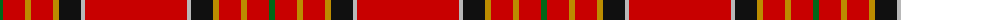
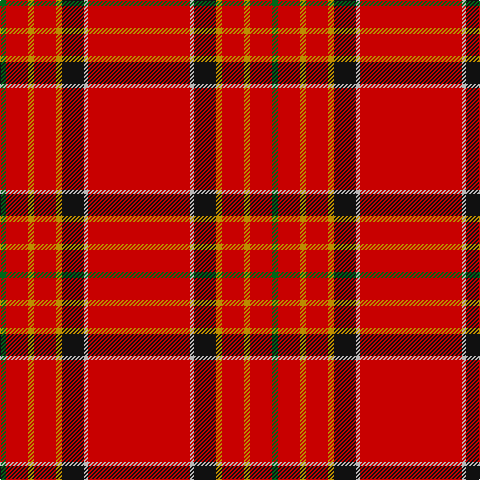

The parent of this is [Hackston (Green stripe) (Portrait)](/tartans/g/6/r22/dy6/r22/dy6/k22/n4/r/102/)

This was sourced from tartans-authority.  It is a [8 stripes tartan](/stripes/stripes8/).

Original link http://www.tartansauthority.com/tartan-ferret/display/907/

## Thread count
G/6 R22 DY6 R22 DY6 K22 N4 R/102

## Palette
Each colour and its ΔE from the base-6 reference it is a variant of.

| Colour | Shade | Base | ΔE (OKLab) |
|---|---|---|---|
| DY |  `#BC8C00` | Y  | 0.16 |
| G |  `#006818` | G  | 0.02 |
| K |  `#101010` | K  | 0.17 |
| N |  `#B8B8B8` | Y  | 0.17 |
| R |  `#C80000` | R  | 0.00 |

# Sample pattern

ID: /variants/g/6/r22/dy6/r22/dy6/k22/n4/r/102-dybc8c00-g006818-k101010-nb8b8b8-rc80000/
