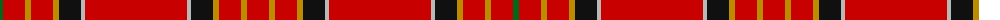

The parent of this is [Hackston (Green stripe) or Halkerston](/tartans/g/6/r22/dy6/r22/dy6/k22/n4/r102/n4/k22/dy6/r22/dy6/r/22/)

This was sourced from register-of-tartans.  It is a [14 stripes tartan](/stripes/stripes14/).

Original link https://www.tartanregister.gov.uk/tartanDetails.aspx?ref=1566

## Thread count
G/6 R22 DY6 R22 DY6 K22 N4 R102 N4 K22 DY6 R22 DY6 R/22

## Palette
Each colour and its ΔE from the base-6 reference it is a variant of.

| Colour | Shade | Base | ΔE (OKLab) |
|---|---|---|---|
| DY |  `#BC8C00` | Y  | 0.16 |
| G |  `#006818` | G  | 0.02 |
| K |  `#101010` | K  | 0.17 |
| N |  `#B8B8B8` | Y  | 0.17 |
| R |  `#C80000` | R  | 0.00 |

ID: /variants/g/6/r22/dy6/r22/dy6/k22/n4/r102/n4/k22/dy6/r22/dy6/r/22-dybc8c00-g006818-k101010-nb8b8b8-rc80000/
