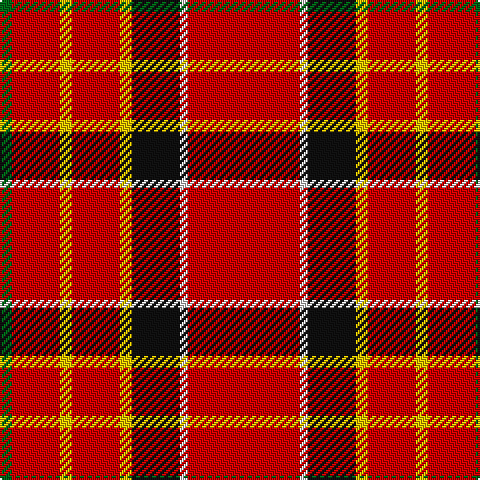

The parent of this is [Hackston or Halkerston Family Tartan Tartan Number: 907. Earliest known date: 1987 Taken from a portrait (c. 1746) Red pivot reduced by half for display. Should read R112. See products available Copyright © Blair Urquhart, Comrie, 2015](/tartans/g/6/r24/y6/r24/y6/k24/ln4/r/56/)

This was sourced from house-of-tartan.  It is a [8 stripes tartan](/stripes/stripes8/).

Original link http://www.house-of-tartan.scotland.net/house/TartanViewjs.asp?colr=Def&tnam=907

## Thread count
G/6 R24 Y6 R24 Y6 K24 LN4 R/56

## Palette
Each colour and its ΔE from the base-6 reference it is a variant of.

| Colour | Shade | Base | ΔE (OKLab) |
|---|---|---|---|
| G |  `#006818` | G  | 0.02 |
| K |  `#101010` | K  | 0.17 |
| LN |  `#E0E0E0` | W  | 0.06 |
| R |  `#C80000` | R  | 0.00 |
| Y |  `#E8C000` | Y  | 0.00 |

# Sample pattern

ID: /variants/g/6/r24/y6/r24/y6/k24/ln4/r/56-g006818-k101010-lne0e0e0-rc80000-ye8c000/
