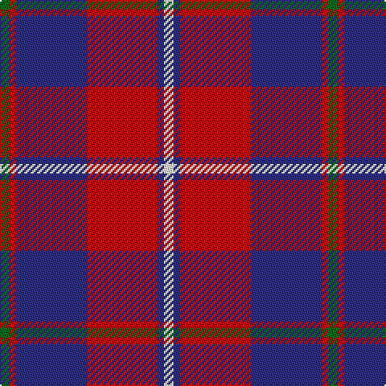

The parent of this is [Galloway, Red (District)](/tartans/g/6/r4/db44/r44/db4/w/6/)

This was sourced from tartans-authority.  It is a [6 stripes tartan](/stripes/stripes6/).

Original link http://www.tartansauthority.com/tartan-ferret/display/843/

## Thread count
G/6 R4 DB44 R44 DB4 W/6

## Palette
Each colour and its ΔE from the base-6 reference it is a variant of.

| Colour | Shade | Base | ΔE (OKLab) |
|---|---|---|---|
| DB |  `#2C2C80` | B  | 0.05 |
| G |  `#006818` | G  | 0.02 |
| R |  `#C80000` | R  | 0.00 |
| W |  `#FCFCFC` | W  | 0.03 |

# Sample pattern

ID: /variants/g/6/r4/db44/r44/db4/w/6-db2c2c80-g006818-rc80000-wfcfcfc/
