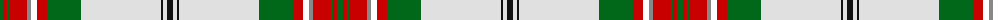

The parent of this is [Allandale Red Dress Tartan Tartan Number: 8457. Earliest known date: Threadcount and colours aren't 100% original. Generated manually. See products available Copyright © Blair Urquhart, Comrie, 2015](/tartans/g/6/r4/g2/r18/n4/y6/r10/g34/ln80/k2/ln4/k/6/)

This was sourced from house-of-tartan.  It is a [12 stripes tartan](/stripes/stripes12/).

Original link http://www.house-of-tartan.scotland.net/house/TartanViewjs.asp?colr=Def&tnam=8457

## Thread count
G/6 R4 G2 R18 N4 Y6 R10 G34 LN80 K2 LN4 K/6

## Palette
Each colour and its ΔE from the base-6 reference it is a variant of.

| Colour | Shade | Base | ΔE (OKLab) |
|---|---|---|---|
| G |  `#006818` | G  | 0.02 |
| K |  `#101010` | K  | 0.17 |
| LN |  `#E0E0E0` | W  | 0.06 |
| N |  `#888888` | R  | 0.24 |
| R |  `#C80000` | R  | 0.00 |

ID: /variants/g/6/r4/g2/r18/n4/y6/r10/g34/ln80/k2/ln4/k/6-g006818-k101010-lne0e0e0-n888888-rc80000/
