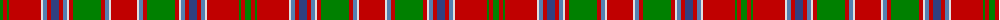

The parent of this is [MacDonald of Lochmaddy](/tartans/g/6/r4/g2/r32/ln2/ba4/r4/b8/r4/ba4/ln2/r4/g28/r4/ba4/ln2/r/26/)

This was sourced from weddslist.  It is a [17 stripes tartan](/stripes/stripes17/).

Original link http://www.weddslist.com/cgi-bin/tartans/pg.pl?source=sts

## Thread count
G/6 R4 G2 R32 LN2 Ba4 R4 B8 R4 Ba4 LN2 R4 G28 R4 Ba4 LN2 R/26

## Palette
Each colour and its ΔE from the base-6 reference it is a variant of.

| Colour | Shade | Base | ΔE (OKLab) |
|---|---|---|---|
| B |  `#304080` | B  | 0.01 |
| Ba |  `#5480B0` | B  | 0.20 |
| G |  `#008000` | G  | 0.09 |
| LN |  `#E0E0E0` | W  | 0.06 |
| R |  `#C00000` | R  | 0.02 |

ID: /variants/g/6/r4/g2/r32/ln2/ba4/r4/b8/r4/ba4/ln2/r4/g28/r4/ba4/ln2/r/26-b304080-ba5480b0-g008000-lne0e0e0-rc00000/
