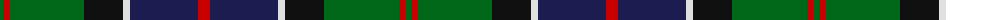

The parent of this is [Rhun (Fashion)](/tartans/g/6/r6/g75/k39/ln7/db68/r/12/)

This was sourced from tartans-authority.  It is a [7 stripes tartan](/stripes/stripes7/).

Original link http://www.tartansauthority.com/tartan-ferret/display/8144/

## Thread count
G/6 R6 G75 K39 LN7 DB68 R/12

## Palette
Each colour and its ΔE from the base-6 reference it is a variant of.

| Colour | Shade | Base | ΔE (OKLab) |
|---|---|---|---|
| DB |  `#1C1C50` | B  | 0.14 |
| G |  `#006818` | G  | 0.02 |
| K |  `#101010` | K  | 0.17 |
| LN |  `#E0E0E0` | W  | 0.06 |
| R |  `#C80000` | R  | 0.00 |

# Sample pattern

ID: /variants/g/6/r6/g75/k39/ln7/db68/r/12-db1c1c50-g006818-k101010-lne0e0e0-rc80000/
