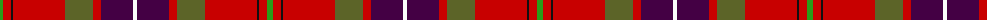

The parent of this is [MacQueen of Dalmagarry (Clan?)](/tartans/g/6/r8/k2/r52/ga28/r8/dp32/w/4/)

This was sourced from tartans-authority.  It is a [8 stripes tartan](/stripes/stripes8/).

Original link http://www.tartansauthority.com/tartan-ferret/display/8892/

## Thread count
G/6 R8 K2 R52 Ga28 R8 DP32 W/4

## Palette
Each colour and its ΔE from the base-6 reference it is a variant of.

| Colour | Shade | Base | ΔE (OKLab) |
|---|---|---|---|
| DP |  `#440044` | B  | 0.17 |
| G |  `#289C18` | G  | 0.18 |
| Ga |  `#5C6428` | G  | 0.09 |
| K |  `#101010` | K  | 0.17 |
| R |  `#C80000` | R  | 0.00 |
| W |  `#FCFCFC` | W  | 0.03 |

# Sample pattern

ID: /variants/g/6/r8/k2/r52/ga28/r8/dp32/w/4-dp440044-g289c18-ga5c6428-k101010-rc80000-wfcfcfc/
