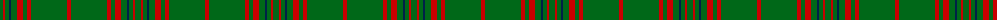

The parent of this is [Owen (Welsh Name)](/tartans/g/6/ra2/g4/dba2/g6/r6/g4/r4/g36/ra/4/)

This was sourced from tartans-authority.  It is a [10 stripes tartan](/stripes/stripes10/).

Original link http://www.tartansauthority.com/tartan-ferret/display/5750/

## Thread count
G/6 Ra2 G4 DBa2 G6 R6 G4 R4 G36 Ra/4

## Palette
Each colour and its ΔE from the base-6 reference it is a variant of.

| Colour | Shade | Base | ΔE (OKLab) |
|---|---|---|---|
| DB |  `#003C64` | B  | 0.07 |
| DBa |  `#002048` | B  | 0.15 |
| G |  `#006818` | G  | 0.02 |
| R |  `#C80000` | R  | 0.00 |
| Ra |  `#C80000` | R  | 0.00 |

ID: /variants/g/6/ra2/g4/dba2/g6/r6/g4/r4/g36/ra/4-db003c64-dba002048-g006818-rc80000-rac80000/
