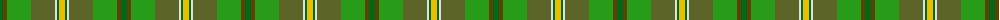

The parent of this is [Braemar House Corporate Tartan Tartan Number: 908. Earliest known date: 1987 The Lords Kilmarnock are descended from both the Hays (the Earls of Errol), and the Stewarts and the design incorporates elements from the Hay-Leith tartan (the red section) and the Hunting Stewart (the green section) with minor alterations to each. The representation here follows the count registered with Lord Lyon on 7th March 1956. The Boyd family are closely associated with the town of Kilmarnock in the South West of the Scottish Lowlands. See products available Copyright © Blair Urquhart, Comrie, 2015](/tartans/g/6/t4/ga24/gb24/ln2/g2/y/6/)

This was sourced from house-of-tartan.  It is a [7 stripes tartan](/stripes/stripes7/).

Original link http://www.house-of-tartan.scotland.net/house/TartanViewjs.asp?colr=Def&tnam=908

## Thread count
G/6 T4 Ga24 Gb24 LN2 G2 Y/6

## Palette
Each colour and its ΔE from the base-6 reference it is a variant of.

| Colour | Shade | Base | ΔE (OKLab) |
|---|---|---|---|
| G |  `#006818` | G  | 0.02 |
| Ga |  `#289C18` | G  | 0.18 |
| Gb |  `#5C6428` | G  | 0.09 |
| LN |  `#E0E0E0` | W  | 0.06 |
| T |  `#604000` | G  | 0.14 |
| Y |  `#E8C000` | Y  | 0.00 |

# Sample pattern

ID: /variants/g/6/t4/ga24/gb24/ln2/g2/y/6-g006818-ga289c18-gb5c6428-lne0e0e0-t604000-ye8c000/
