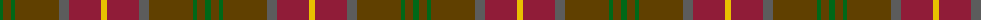

The parent of this is [Pubcrawlers (Corporate)](/tartans/g/6/t8/g4/t44/n10/dr32/y/6/)

This was sourced from tartans-authority.  It is a [7 stripes tartan](/stripes/stripes7/).

Original link http://www.tartansauthority.com/tartan-ferret/display/10668/

## Thread count
G/6 T8 G4 T44 N10 DR32 Y/6

## Palette
Each colour and its ΔE from the base-6 reference it is a variant of.

| Colour | Shade | Base | ΔE (OKLab) |
|---|---|---|---|
| DR |  `#901C38` | R  | 0.12 |
| G |  `#006818` | G  | 0.02 |
| N |  `#5C5C5C` | B  | 0.14 |
| T |  `#604000` | G  | 0.14 |
| Y |  `#E8C000` | Y  | 0.00 |

# Sample pattern

ID: /variants/g/6/t8/g4/t44/n10/dr32/y/6-dr901c38-g006818-n5c5c5c-t604000-ye8c000/
