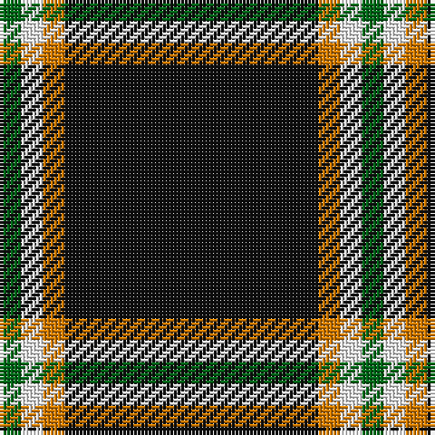

The parent of this is [Dhillon (Personal)](/tartans/g/6/w6/o6/k/70/)

This was sourced from tartans-authority.  It is a [4 stripes tartan](/stripes/stripes4/).

Original link http://www.tartansauthority.com/tartan-ferret/display/7175/

## Thread count
G/6 W6 O6 K/70

## Palette
Each colour and its ΔE from the base-6 reference it is a variant of.

| Colour | Shade | Base | ΔE (OKLab) |
|---|---|---|---|
| G |  `#006818` | G  | 0.02 |
| K |  `#101010` | K  | 0.17 |
| O |  `#D87C00` | Y  | 0.17 |
| W |  `#F8F8F8` | W  | 0.01 |

# Sample pattern

ID: /variants/g/6/w6/o6/k/70-g006818-k101010-od87c00-wf8f8f8/
