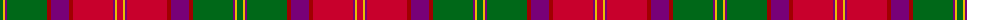

The parent of this is [Scotland (Personal)](/tartans/g/6/y2/p2/g40/dr4/p18/dr4/r40/p2/y2/r/6/)

This was sourced from tartans-authority.  It is a [11 stripes tartan](/stripes/stripes11/).

Original link http://www.tartansauthority.com/tartan-ferret/display/3115/

## Thread count
G/6 Y2 P2 G40 DR4 P18 DR4 R40 P2 Y2 R/6

## Palette
Each colour and its ΔE from the base-6 reference it is a variant of.

| Colour | Shade | Base | ΔE (OKLab) |
|---|---|---|---|
| DR |  `#A00000` | R  | 0.09 |
| G |  `#006818` | G  | 0.02 |
| P |  `#780078` | B  | 0.16 |
| R |  `#C8002C` | R  | 0.03 |
| Y |  `#E8C000` | Y  | 0.00 |

ID: /variants/g/6/y2/p2/g40/dr4/p18/dr4/r40/p2/y2/r/6-dra00000-g006818-p780078-rc8002c-ye8c000/
