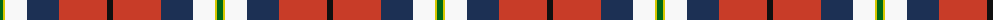

The parent of this is [Bro-sant-Malou (Corporate)](/tartans/g/6/y2/w22/db32/r48/k/6/)

This was sourced from tartans-authority.  It is a [6 stripes tartan](/stripes/stripes6/).

Original link http://www.tartansauthority.com/tartan-ferret/display/6649/

## Thread count
G/6 Y2 W22 DB32 R48 K/6

## Palette
Each colour and its ΔE from the base-6 reference it is a variant of.

| Colour | Shade | Base | ΔE (OKLab) |
|---|---|---|---|
| DB |  `#1C3054` | B  | 0.10 |
| G |  `#006818` | G  | 0.02 |
| K |  `#101010` | K  | 0.17 |
| R |  `#C83C28` | R  | 0.05 |
| W |  `#F8F8F8` | W  | 0.01 |
| Y |  `#D8C800` | Y  | 0.03 |

# Sample pattern

ID: /variants/g/6/y2/w22/db32/r48/k/6-db1c3054-g006818-k101010-rc83c28-wf8f8f8-yd8c800/
