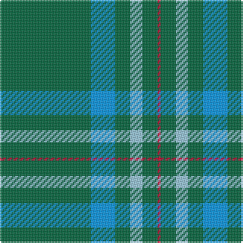

The parent of this is [Annapolis Valley](/tartans/g/60/b16/g10/lb8/g10/r/2/)

This was sourced from register-of-tartans.  It is a [6 stripes tartan](/stripes/stripes6/).

Original link https://www.tartanregister.gov.uk/tartanDetails.aspx?ref=11065

## Thread count
G/60 B16 G10 LB8 G10 R/2

## Palette
Each colour and its ΔE from the base-6 reference it is a variant of.

| Colour | Shade | Base | ΔE (OKLab) |
|---|---|---|---|
| B |  `#0596FA` | B  | 0.28 |
| G |  `#00643C` | G  | 0.06 |
| LB |  `#98C8E8` | W  | 0.17 |
| R |  `#C8002C` | R  | 0.03 |

# Sample pattern

ID: /variants/g/60/b16/g10/lb8/g10/r/2-b0596fa-g00643c-lb98c8e8-rc8002c/
