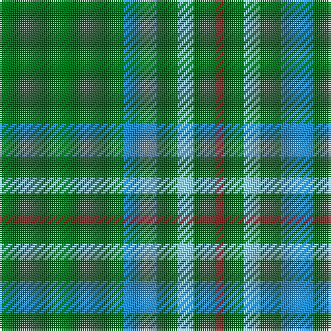

The parent of this is [Annapolis Valley](/tartans/g/60/b16/g10/lb8/g10/r/4/)

This was sourced from tartans-authority.  It is a [6 stripes tartan](/stripes/stripes6/).

Original link http://www.tartansauthority.com/tartan-ferret/display/11065/

## Thread count
G/60 B16 G10 LB8 G10 R/4

## Palette
Each colour and its ΔE from the base-6 reference it is a variant of.

| Colour | Shade | Base | ΔE (OKLab) |
|---|---|---|---|
| B |  `#2888C4` | B  | 0.21 |
| G |  `#006818` | G  | 0.02 |
| LB |  `#98C8E8` | W  | 0.17 |
| R |  `#C80000` | R  | 0.00 |

# Sample pattern

ID: /variants/g/60/b16/g10/lb8/g10/r/4-b2888c4-g006818-lb98c8e8-rc80000/
