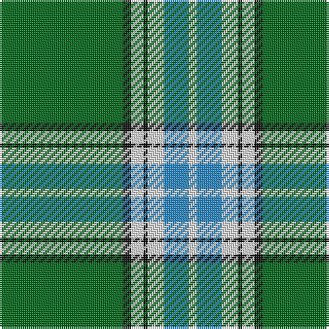

The parent of this is [Madras 2 (Fashion)](/tartans/g/60/k4/ln6/k2/ln8/b12/ln/4/)

This was sourced from tartans-authority.  It is a [7 stripes tartan](/stripes/stripes7/).

Original link http://www.tartansauthority.com/tartan-ferret/display/8601/

## Thread count
G/60 K4 LN6 K2 LN8 B12 LN/4

## Palette
Each colour and its ΔE from the base-6 reference it is a variant of.

| Colour | Shade | Base | ΔE (OKLab) |
|---|---|---|---|
| B |  `#2888C4` | B  | 0.21 |
| G |  `#006818` | G  | 0.02 |
| K |  `#101010` | K  | 0.17 |
| LN |  `#E0E0E0` | W  | 0.06 |

# Sample pattern

ID: /variants/g/60/k4/ln6/k2/ln8/b12/ln/4-b2888c4-g006818-k101010-lne0e0e0/
