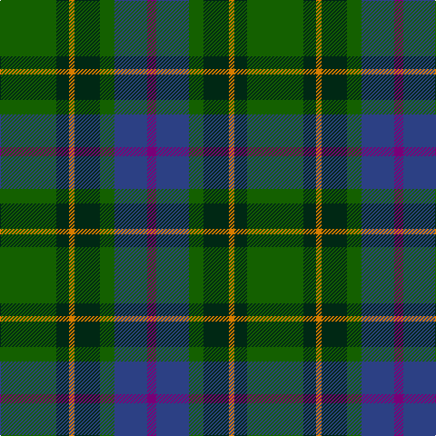

The parent of this is [Reidy Wedding](/tartans/g/62/dg14/o6/dg28/g16/b36/p/10/)

This was sourced from register-of-tartans.  It is a [7 stripes tartan](/stripes/stripes7/).

Original link https://www.tartanregister.gov.uk/tartanDetails.aspx?ref=11293

## Thread count
G/62 DG14 O6 DG28 G16 B36 P/10

## Palette
Each colour and its ΔE from the base-6 reference it is a variant of.

| Colour | Shade | Base | ΔE (OKLab) |
|---|---|---|---|
| B |  `#2C4084` | B  | 0.00 |
| DG |  `#002814` | B  | 0.21 |
| G |  `#146000` | G  | 0.01 |
| O |  `#D87C00` | Y  | 0.17 |
| P |  `#780078` | B  | 0.16 |

# Sample pattern

ID: /variants/g/62/dg14/o6/dg28/g16/b36/p/10-b2c4084-dg002814-g146000-od87c00-p780078/
