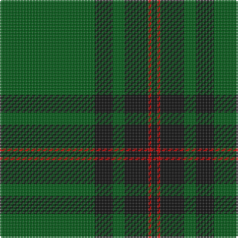

The parent of this is [Fife (District)](/tartans/g/64/k12/g8/k16/r2/k/4/)

This was sourced from tartans-authority.  It is a [6 stripes tartan](/stripes/stripes6/).

Original link http://www.tartansauthority.com/tartan-ferret/display/790/

## Thread count
G/64 K12 G8 K16 R2 K/4

## Palette
Each colour and its ΔE from the base-6 reference it is a variant of.

| Colour | Shade | Base | ΔE (OKLab) |
|---|---|---|---|
| G |  `#005814` | G  | 0.04 |
| K |  `#101010` | K  | 0.17 |
| R |  `#C80000` | R  | 0.00 |

# Sample pattern

ID: /variants/g/64/k12/g8/k16/r2/k/4-g005814-k101010-rc80000/
