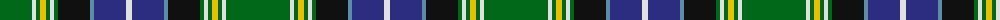

The parent of this is [MacKellar Clan Tartan Tartan Number: 939. Earliest known date: pre 2003 As worn by Kenneth? - D.C.S. See products available Copyright © Blair Urquhart, Comrie, 2015](/tartans/g/64/ln4/g4/y6/g4/ln4/g4/k32/b4/db32/ln/6/)

This was sourced from house-of-tartan.  It is a [11 stripes tartan](/stripes/stripes11/).

Original link http://www.house-of-tartan.scotland.net/house/TartanViewjs.asp?colr=Def&tnam=939

## Thread count
G/64 LN4 G4 Y6 G4 LN4 G4 K32 B4 DB32 LN/6

## Palette
Each colour and its ΔE from the base-6 reference it is a variant of.

| Colour | Shade | Base | ΔE (OKLab) |
|---|---|---|---|
| B |  `#5C8CA8` | B  | 0.23 |
| DB |  `#2C2C80` | B  | 0.05 |
| G |  `#006818` | G  | 0.02 |
| K |  `#101010` | K  | 0.17 |
| LN |  `#E0E0E0` | W  | 0.06 |
| Y |  `#E8C000` | Y  | 0.00 |

ID: /variants/g/64/ln4/g4/y6/g4/ln4/g4/k32/b4/db32/ln/6-b5c8ca8-db2c2c80-g006818-k101010-lne0e0e0-ye8c000/
