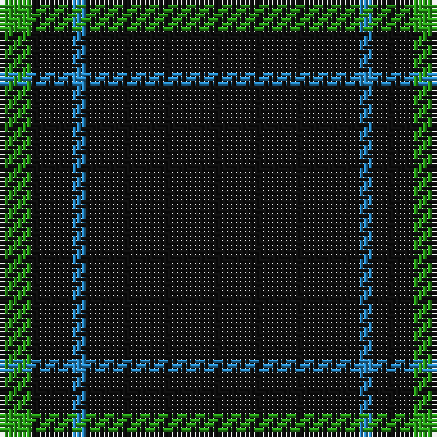

The parent of this is [Wallington (Corporate?)](/tartans/g/7/k9/b3/k/60/)

This was sourced from tartans-authority.  It is a [4 stripes tartan](/stripes/stripes4/).

Original link http://www.tartansauthority.com/tartan-ferret/display/6018/

## Thread count
G/7 K9 B3 K/60

## Palette
Each colour and its ΔE from the base-6 reference it is a variant of.

| Colour | Shade | Base | ΔE (OKLab) |
|---|---|---|---|
| B |  `#2888C4` | B  | 0.21 |
| G |  `#289C18` | G  | 0.18 |
| K |  `#101010` | K  | 0.17 |

# Sample pattern

ID: /variants/g/7/k9/b3/k/60-b2888c4-g289c18-k101010/
