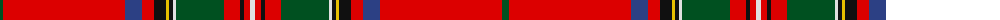

The parent of this is [Stuart/Stewart of Rothesay](/tartans/g/7/r122/b17/r12/k12/y3/k4/ln3/g48/r16/k4/r6/ln/5/)

This was sourced from register-of-tartans.  It is a [13 stripes tartan](/stripes/stripes13/).

Original link https://www.tartanregister.gov.uk/tartanDetails.aspx?ref=4020

## Thread count
G/7 R122 B17 R12 K12 Y3 K4 LN3 G48 R16 K4 R6 LN/5

## Palette
Each colour and its ΔE from the base-6 reference it is a variant of.

| Colour | Shade | Base | ΔE (OKLab) |
|---|---|---|---|
| B |  `#2C4084` | B  | 0.00 |
| G |  `#005020` | G  | 0.08 |
| K |  `#101010` | K  | 0.17 |
| LN |  `#E0E0E0` | W  | 0.06 |
| R |  `#DC0000` | R  | 0.04 |
| Y |  `#E8C000` | Y  | 0.00 |

ID: /variants/g/7/r122/b17/r12/k12/y3/k4/ln3/g48/r16/k4/r6/ln/5-b2c4084-g005020-k101010-lne0e0e0-rdc0000-ye8c000/
