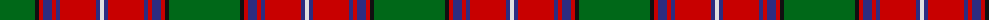

The parent of this is [Rattray Family Tartan Tartan Number: 819. Earliest known date: pre 2003 A Follower, but not a Sept, of the Murrays of Atholl. The family descends from Adam de Rattrieff in the 13th century. Their ancient seat is at Craighall, Blairgowrie, in Perthshire. See products available Copyright © Blair Urquhart, Comrie, 2015](/tartans/g/71/k4/r4/db9/r4/db4/r36/db4/ln/4/)

This was sourced from house-of-tartan.  It is a [9 stripes tartan](/stripes/stripes9/).

Original link http://www.house-of-tartan.scotland.net/house/TartanViewjs.asp?colr=Def&tnam=819

## Thread count
G/71 K4 R4 DB9 R4 DB4 R36 DB4 LN/4

## Palette
Each colour and its ΔE from the base-6 reference it is a variant of.

| Colour | Shade | Base | ΔE (OKLab) |
|---|---|---|---|
| DB |  `#2C2C80` | B  | 0.05 |
| G |  `#006818` | G  | 0.02 |
| K |  `#101010` | K  | 0.17 |
| LN |  `#E0E0E0` | W  | 0.06 |
| R |  `#C80000` | R  | 0.00 |

ID: /variants/g/71/k4/r4/db9/r4/db4/r36/db4/ln/4-db2c2c80-g006818-k101010-lne0e0e0-rc80000/
