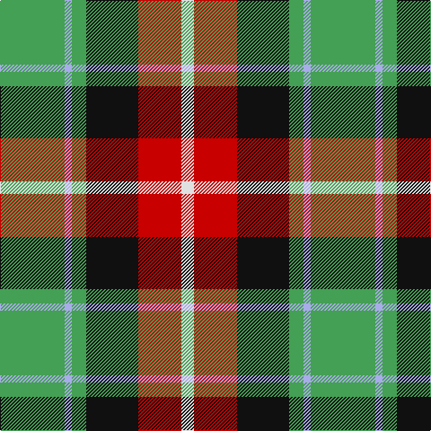

The parent of this is [Entre Rios Province (District?)](/tartans/g/72/lp8/g16/k58/r48/ln/14/)

This was sourced from tartans-authority.  It is a [6 stripes tartan](/stripes/stripes6/).

Original link http://www.tartansauthority.com/tartan-ferret/display/7310/

## Thread count
G/72 LP8 G16 K58 R48 LN/14

## Palette
Each colour and its ΔE from the base-6 reference it is a variant of.

| Colour | Shade | Base | ΔE (OKLab) |
|---|---|---|---|
| G |  `#44A054` | G  | 0.20 |
| K |  `#101010` | K  | 0.17 |
| LN |  `#E0E0E0` | W  | 0.06 |
| LP |  `#A8ACE8` | W  | 0.22 |
| R |  `#C80000` | R  | 0.00 |

# Sample pattern

ID: /variants/g/72/lp8/g16/k58/r48/ln/14-g44a054-k101010-lne0e0e0-lpa8ace8-rc80000/
