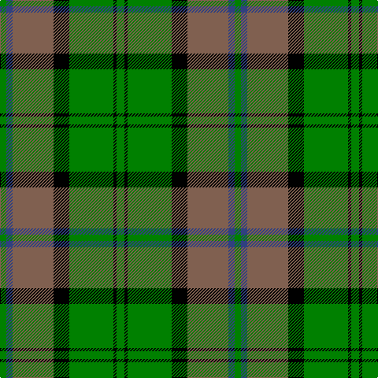

The parent of this is [John Telfar, Dunbar hunting](/tartans/g/8/b8/lt52/k20/g56/k4/g/10/)

This was sourced from weddslist.  It is a [7 stripes tartan](/stripes/stripes7/).

Original link http://www.weddslist.com/cgi-bin/tartans/pg.pl?source=sts

## Thread count
G/8 B8 LT52 K20 G56 K4 G/10

## Palette
Each colour and its ΔE from the base-6 reference it is a variant of.

| Colour | Shade | Base | ΔE (OKLab) |
|---|---|---|---|
| B |  `#304080` | B  | 0.01 |
| G |  `#008000` | G  | 0.09 |
| K |  `#000000` | K  | 0.00 |
| LT |  `#806050` | R  | 0.17 |

# Sample pattern

ID: /variants/g/8/b8/lt52/k20/g56/k4/g/10-b304080-g008000-k000000-lt806050/
