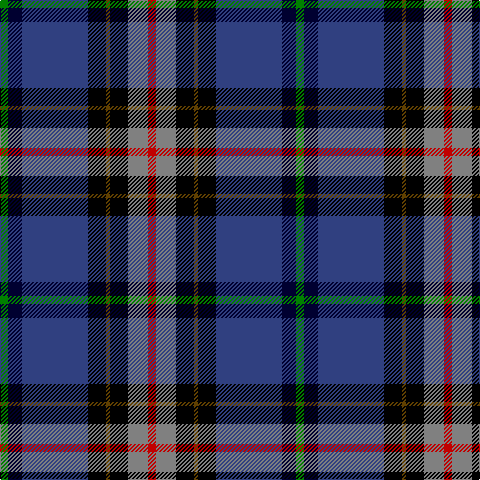

The parent of this is [Anne Arundel County](/tartans/g/8/db14/b66/k18/t4/k18/n20/r/8/)

This was sourced from weddslist.  It is a [8 stripes tartan](/stripes/stripes8/).

Original link http://www.weddslist.com/cgi-bin/tartans/pg.pl?source=sts

## Thread count
G/8 DB14 B66 K18 T4 K18 N20 R/8

## Palette
Each colour and its ΔE from the base-6 reference it is a variant of.

| Colour | Shade | Base | ΔE (OKLab) |
|---|---|---|---|
| B |  `#304080` | B  | 0.01 |
| DB |  `#000030` | K  | 0.17 |
| G |  `#008000` | G  | 0.09 |
| K |  `#000000` | K  | 0.00 |
| N |  `#808080` | G  | 0.22 |
| R |  `#C00000` | R  | 0.02 |
| T |  `#604000` | G  | 0.14 |

# Sample pattern

ID: /variants/g/8/db14/b66/k18/t4/k18/n20/r/8-b304080-db000030-g008000-k000000-n808080-rc00000-t604000/
