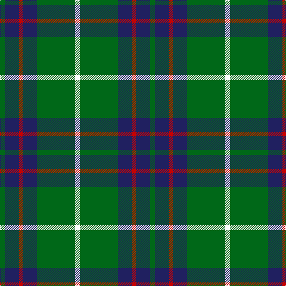

The parent of this is [MacIntyre - 1842 (VS) (Clan)](/tartans/g/8/db24/r6/db24/g64/w/8/)

This was sourced from tartans-authority.  It is a [6 stripes tartan](/stripes/stripes6/).

Original link http://www.tartansauthority.com/tartan-ferret/display/743/

## Thread count
G/8 DB24 R6 DB24 G64 W/8

## Palette
Each colour and its ΔE from the base-6 reference it is a variant of.

| Colour | Shade | Base | ΔE (OKLab) |
|---|---|---|---|
| DB |  `#202060` | B  | 0.11 |
| G |  `#006818` | G  | 0.02 |
| R |  `#C80000` | R  | 0.00 |
| W |  `#FCFCFC` | W  | 0.03 |

# Sample pattern

ID: /variants/g/8/db24/r6/db24/g64/w/8-db202060-g006818-rc80000-wfcfcfc/
