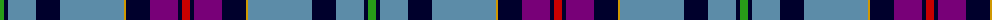

The parent of this is [Timmins (2013)](/tartans/g/8/db4/b28/db24/b64/dy2/db24/p28/db4/r/8/)

This was sourced from tartans-authority.  It is a [10 stripes tartan](/stripes/stripes10/).

Original link http://www.tartansauthority.com/tartan-ferret/display/10911/

## Thread count
G/8 DB4 B28 DB24 B64 DY2 DB24 P28 DB4 R/8

## Palette
Each colour and its ΔE from the base-6 reference it is a variant of.

| Colour | Shade | Base | ΔE (OKLab) |
|---|---|---|---|
| B |  `#5C8CA8` | B  | 0.23 |
| DB |  `#00002C` | K  | 0.16 |
| DY |  `#D09800` | Y  | 0.11 |
| G |  `#289C18` | G  | 0.18 |
| P |  `#780078` | B  | 0.16 |
| R |  `#C80000` | R  | 0.00 |

ID: /variants/g/8/db4/b28/db24/b64/dy2/db24/p28/db4/r/8-b5c8ca8-db00002c-dyd09800-g289c18-p780078-rc80000/
