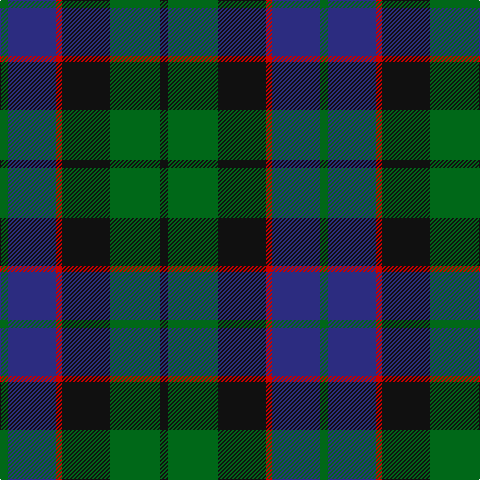

The parent of this is [Ferguson of Balquhidder Clan Tartan Tartan Number: 738. Earliest known date: 1977 (1831) Logan records only two threads for the red stripe. D.C. Stewart calls this Ferguson of Balquhidder to differenciate it from the Ferguson of Athol. Chiefs of the Clan are the Fergussons of Kilkerran, descended from Fergus of Dalriada, who brought the 'Stone of Scone' to Scotland. The Fergussons of Perthshire were recognised as the principal Highland branch of the clan and the chiefship belonged to 'MacFhearghuis' of Dunfallandy. The present day chief is Sir Charles Fergusson of Kilkerran, Bt. See products available Copyright © Blair Urquhart, Comrie, 2015](/tartans/g/8/db48/r6/k48/g50/k/8/)

This was sourced from house-of-tartan.  It is a [6 stripes tartan](/stripes/stripes6/).

Original link http://www.house-of-tartan.scotland.net/house/TartanViewjs.asp?colr=Def&tnam=738

## Thread count
G/8 DB48 R6 K48 G50 K/8

## Palette
Each colour and its ΔE from the base-6 reference it is a variant of.

| Colour | Shade | Base | ΔE (OKLab) |
|---|---|---|---|
| DB |  `#2C2C80` | B  | 0.05 |
| G |  `#006818` | G  | 0.02 |
| K |  `#101010` | K  | 0.17 |
| R |  `#C80000` | R  | 0.00 |

# Sample pattern

ID: /variants/g/8/db48/r6/k48/g50/k/8-db2c2c80-g006818-k101010-rc80000/
