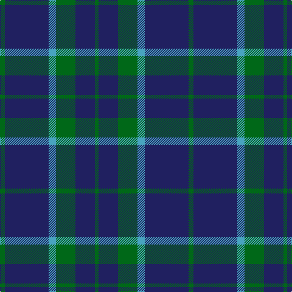

The parent of this is [City of Kincardine (District)](/tartans/g/8/db72/b12/g32/db32/g/6/)

This was sourced from tartans-authority.  It is a [6 stripes tartan](/stripes/stripes6/).

Original link http://www.tartansauthority.com/tartan-ferret/display/2590/

## Thread count
G/8 DB72 B12 G32 DB32 G/6

## Palette
Each colour and its ΔE from the base-6 reference it is a variant of.

| Colour | Shade | Base | ΔE (OKLab) |
|---|---|---|---|
| B |  `#48A4C0` | Y  | 0.28 |
| DB |  `#202060` | B  | 0.11 |
| G |  `#006818` | G  | 0.02 |

# Sample pattern

ID: /variants/g/8/db72/b12/g32/db32/g/6-b48a4c0-db202060-g006818/
