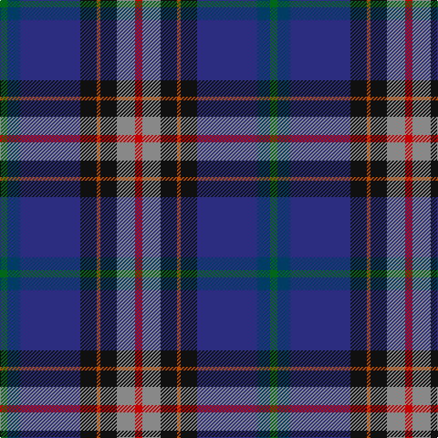

The parent of this is [Anne Arundel County (District)](/tartans/g/8/dba14/db66/k18/do4/k18/n20/r/8/)

This was sourced from tartans-authority.  It is a [8 stripes tartan](/stripes/stripes8/).

Original link http://www.tartansauthority.com/tartan-ferret/display/2453/

## Thread count
G/8 DBa14 DB66 K18 DO4 K18 N20 R/8

## Palette
Each colour and its ΔE from the base-6 reference it is a variant of.

| Colour | Shade | Base | ΔE (OKLab) |
|---|---|---|---|
| DB |  `#2C2C80` | B  | 0.05 |
| DBa |  `#003C64` | B  | 0.07 |
| DO |  `#B84C00` | R  | 0.08 |
| G |  `#006818` | G  | 0.02 |
| K |  `#101010` | K  | 0.17 |
| N |  `#888888` | R  | 0.24 |
| R |  `#C80000` | R  | 0.00 |

# Sample pattern

ID: /variants/g/8/dba14/db66/k18/do4/k18/n20/r/8-db2c2c80-dba003c64-dob84c00-g006818-k101010-n888888-rc80000/
