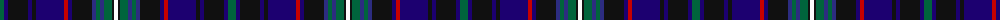

The parent of this is [Barry (Name)](/tartans/g/8/dba4/k20/dba4/k4/dba28/r4/dba4/k20/db4/g4/db4/g8/k2/w/4/)

This was sourced from tartans-authority.  It is a [15 stripes tartan](/stripes/stripes15/).

Original link http://www.tartansauthority.com/tartan-ferret/display/8572/

## Thread count
G/8 DBa4 K20 DBa4 K4 DBa28 R4 DBa4 K20 DB4 G4 DB4 G8 K2 W/4

## Palette
Each colour and its ΔE from the base-6 reference it is a variant of.

| Colour | Shade | Base | ΔE (OKLab) |
|---|---|---|---|
| DB |  `#2C2C80` | B  | 0.05 |
| DBa |  `#1C0070` | B  | 0.14 |
| G |  `#00643C` | G  | 0.06 |
| K |  `#101010` | K  | 0.17 |
| R |  `#C80000` | R  | 0.00 |
| W |  `#FCFCFC` | W  | 0.03 |

ID: /variants/g/8/dba4/k20/dba4/k4/dba28/r4/dba4/k20/db4/g4/db4/g8/k2/w/4-db2c2c80-dba1c0070-g00643c-k101010-rc80000-wfcfcfc/
