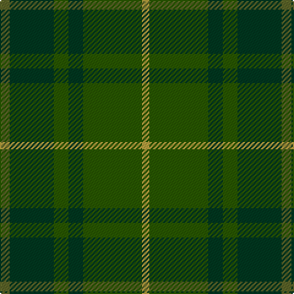

The parent of this is [Park (Estate Check)](/tartans/g/8/dg36/ga12/dg12/ga48/o/6/)

This was sourced from tartans-authority.  It is a [6 stripes tartan](/stripes/stripes6/).

Original link http://www.tartansauthority.com/tartan-ferret/display/5519/

## Thread count
G/8 DG36 Ga12 DG12 Ga48 O/6

## Palette
Each colour and its ΔE from the base-6 reference it is a variant of.

| Colour | Shade | Base | ΔE (OKLab) |
|---|---|---|---|
| DG |  `#003820` | G  | 0.16 |
| G |  `#5C6428` | G  | 0.09 |
| Ga |  `#285800` | G  | 0.04 |
| O |  `#B8A040` | Y  | 0.12 |

# Sample pattern

ID: /variants/g/8/dg36/ga12/dg12/ga48/o/6-dg003820-g5c6428-ga285800-ob8a040/
