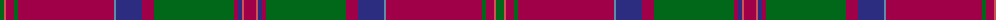

The parent of this is [MacDonald of Glencoe Artifact Tartan Tartan Number: 1012. Earliest known date: 17th century Cargill fragment now at Fort William museum. See products available Copyright © Blair Urquhart, Comrie, 2015](/tartans/g/8/do2/r8/g4/r96/b2/db26/r12/g80/r4/db4/do2/r/12/)

This was sourced from house-of-tartan.  It is a [13 stripes tartan](/stripes/stripes13/).

Original link http://www.house-of-tartan.scotland.net/house/TartanViewjs.asp?colr=Def&tnam=1012

## Thread count
G/8 DO2 R8 G4 R96 B2 DB26 R12 G80 R4 DB4 DO2 R/12

## Palette
Each colour and its ΔE from the base-6 reference it is a variant of.

| Colour | Shade | Base | ΔE (OKLab) |
|---|---|---|---|
| B |  `#5C8CA8` | B  | 0.23 |
| DB |  `#2C2C80` | B  | 0.05 |
| DO |  `#D05054` | R  | 0.10 |
| G |  `#006818` | G  | 0.02 |
| R |  `#A00048` | R  | 0.11 |
| Ra |  `#C80000` | R  | 0.00 |

ID: /variants/g/8/do2/r8/g4/r96/b2/db26/r12/g80/r4/db4/do2/r/12-b5c8ca8-db2c2c80-dod05054-g006818-ra00048-rac80000/
