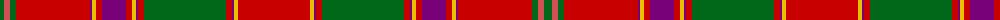

The parent of this is [Lochiel (Cameron) Tartan Tartan Number: 973. Earliest known date: 1819 Nothing See products available Copyright © Blair Urquhart, Comrie, 2015](/tartans/g/8/do6/g6/r74/p2/y4/r6/p24/r6/y4/p2/r6/g82/r6/p2/y4/r/72/)

This was sourced from house-of-tartan.  It is a [17 stripes tartan](/stripes/stripes17/).

Original link http://www.house-of-tartan.scotland.net/house/TartanViewjs.asp?colr=Def&tnam=973

## Thread count
G/8 DO6 G6 R74 P2 Y4 R6 P24 R6 Y4 P2 R6 G82 R6 P2 Y4 R/72

## Palette
Each colour and its ΔE from the base-6 reference it is a variant of.

| Colour | Shade | Base | ΔE (OKLab) |
|---|---|---|---|
| DO |  `#D05054` | R  | 0.10 |
| G |  `#006818` | G  | 0.02 |
| P |  `#780078` | B  | 0.16 |
| R |  `#C80000` | R  | 0.00 |
| Y |  `#E8C000` | Y  | 0.00 |

ID: /variants/g/8/do6/g6/r74/p2/y4/r6/p24/r6/y4/p2/r6/g82/r6/p2/y4/r/72-dod05054-g006818-p780078-rc80000-ye8c000/
