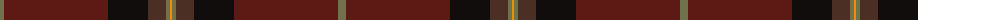

The parent of this is [Jack, John (Fife) Name Tartan Tartan Number: 10719. Earliest known date: 22 October 2012 Designed for members of Mr Jack's extended family who bear the surname Jack, to use at family gatherings. See products available Copyright © Blair Urquhart, Comrie, 2015](/tartans/g/8/dr104/k40/t18/g4/o/2/)

This was sourced from house-of-tartan.  It is a [6 stripes tartan](/stripes/stripes6/).

Original link http://www.house-of-tartan.scotland.net/house/TartanViewjs.asp?colr=Def&tnam=10719

## Thread count
G/8 DR104 K40 T18 G4 O/2

## Palette
Each colour and its ΔE from the base-6 reference it is a variant of.

| Colour | Shade | Base | ΔE (OKLab) |
|---|---|---|---|
| DR |  `#5D1913` | B  | 0.20 |
| G |  `#70714D` | G  | 0.15 |
| K |  `#120D0D` | K  | 0.17 |
| O |  `#EF8F06` | Y  | 0.12 |
| T |  `#4B2E24` | B  | 0.16 |

# Sample pattern

ID: /variants/g/8/dr104/k40/t18/g4/o/2-dr5d1913-g70714d-k120d0d-oef8f06-t4b2e24/
