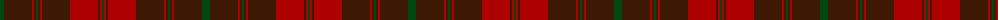

The parent of this is [Frame (Ferniegair) (Personal)](/tartans/g/8/dr28/dra2/dr2/g2/dr2/dra2/dr28/dra28/dr2/dra2/g/2/)

This was sourced from register-of-tartans.  It is a [12 stripes tartan](/stripes/stripes12/).

Original link https://www.tartanregister.gov.uk/tartanDetails.aspx?ref=10614

## Thread count
G/8 DR28 DRa2 DR2 G2 DR2 DRa2 DR28 DRa28 DR2 DRa2 G/2

## Palette
Each colour and its ΔE from the base-6 reference it is a variant of.

| Colour | Shade | Base | ΔE (OKLab) |
|---|---|---|---|
| DR |  `#3D1903` | B  | 0.22 |
| DRa |  `#AD0000` | R  | 0.06 |
| G |  `#00480D` | G  | 0.10 |

ID: /variants/g/8/dr28/dra2/dr2/g2/dr2/dra2/dr28/dra28/dr2/dra2/g/2-dr3d1903-draad0000-g00480d/
